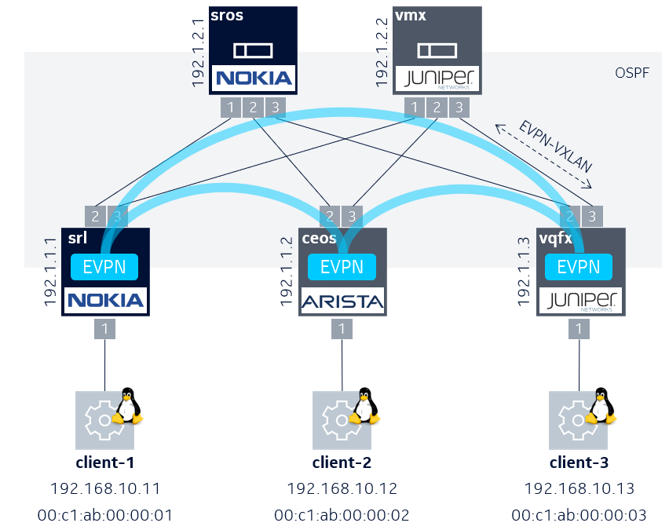

# Multivendor EVPN lab
This repository lets you deploy a multivendor lab by using [containerlab](https://containerlab.dev/) to build up the topology. With the files contained in this repository you are able to spin up a two-tier clos topology containing a L2 EVPN service distributed across the leaf switches (Nokia SR Linux, Arista cEOS and Juniper vQFX). OSPF is configured in the underlay to distribute the VTEP addresses and both spines (Nokia SROS and Juniper VMX) function as route reflectors to distribute EVPN routes with iBGP.



## Lab lifecycle
With containerlab we can easily deploy a multivendor topology by defining all interlinks and node specific information in one YAML [file](https://github.com/srl-labs/multivendor-evpn-lab/blob/master/multivendor-evpn.clab.yml). This file can be used to deploy our topology by passing it as an argument with the `deploy` command.
```
clab deploy -t multivendor-evpn.clab.yml
```
Same goes for destroying the lab
```
clab destroy -t multivendor-evpn.clab.yml
```
## Accessing the network elements
After deploying the lab, you will see a summary of the deployed nodes in table format like below. To access a network element with SSH simply use the hostname as described in the table.
```
ssh admin@clab-multivendor-srl
```
The Linux CE clients can be accessed as regular containers, you can connect to them just like to any other container
```
docker exec -it clab-multivendor-client-1 bash
```
```
+---+---------------------------+--------------+--------------------------------------------+---------+---------+-----------------+-----------------------+
| # |           Name            | Container ID |                   Image                    |  Kind   |  State  |  IPv4 Address   |     IPv6 Address      |
+---+---------------------------+--------------+--------------------------------------------+---------+---------+-----------------+-----------------------+
| 1 | clab-multivendor-ceos     | 8a0e11627564 | registry.srlinux.dev/pub/ceos:4.26.2.1F    | ceos    | running | 172.20.20.5/24  | 2001:172:20:20::5/64  |
| 2 | clab-multivendor-client-1 | dd87e9c05565 | ghcr.io/hellt/network-multitool            | linux   | running | 172.20.20.12/24 | 2001:172:20:20::c/64  |
| 3 | clab-multivendor-client-2 | ec21d39903e8 | ghcr.io/hellt/network-multitool            | linux   | running | 172.20.20.16/24 | 2001:172:20:20::10/64 |
| 4 | clab-multivendor-client-3 | 1c3fe19ddfde | ghcr.io/hellt/network-multitool            | linux   | running | 172.20.20.6/24  | 2001:172:20:20::6/64  |
| 5 | clab-multivendor-srl      | eb972bd68927 | ghcr.io/nokia/srlinux:21.11.3              | srl     | running | 172.20.20.31/24 | 2001:172:20:20::1f/64 |
| 6 | clab-multivendor-sros     | 5f44a208553e | registry.srlinux.dev/pub/vr-sros:22.5.R1   | vr-sros | running | 172.20.20.28/24 | 2001:172:20:20::1c/64 |
| 7 | clab-multivendor-vmx      | c5a3622dae2f | registry.srlinux.dev/pub/vr-vmx:21.1R1.11  | vr-vmx  | running | 172.20.20.30/24 | 2001:172:20:20::1e/64 |
| 8 | clab-multivendor-vqfx     | 9dd9cbcb3270 | registry.srlinux.dev/pub/vr-vqfx:19.4R1.10 | vr-vqfx | running | 172.20.20.29/24 | 2001:172:20:20::1d/64 |
+---+---------------------------+--------------+--------------------------------------------+---------+---------+-----------------+-----------------------+
```

## Configuration
All nodes come preconfigured thanks to startup-config setting in the topology file multivendor-evpn.clab.yml. The only node that needs extra configuration after deployment is the Juniper VMX spine. You can find the configuration [here](https://github.com/srl-labs/multivendor-evpn-lab/blob/master/config/vmx.cfg). Connect to the VMX spine, enter configuration mode by typing `configure`. Copy paste the configuration in the terminal and `commit` the changes.

## Sending traffic
The three Linux clients share the same broadcast domain (192.168.10.0/24) as defined by a L2 EVPN service distributed over the leaves. Each client is already assigned with an IP and MAC address as shown in the topology image above.
- client-1 = 192.168.10.11
- client-2 = 192.168.10.12
- client-3 = 192.168.10.13

For functional testing we can start sending a ping between clients
<pre>
<b># docker exec -it clab-multivendor-client-1 bash</b>
bash-5.0#
bash-5.0# <b>ping -c 3 192.168.10.12</b>
PING 192.168.10.12 (192.168.10.12) 56(84) bytes of data.
64 bytes from <b>192.168.10.12</b>: icmp_seq=1 ttl=64 time=4.80 ms
64 bytes from <b>192.168.10.12</b>: icmp_seq=2 ttl=64 time=5.21 ms
64 bytes from <b>192.168.10.12</b>: icmp_seq=3 ttl=64 time=4.76 ms

--- 192.168.10.12 ping statistics ---
3 packets transmitted, 3 received, 0% packet loss, time 2003ms
rtt min/avg/max/mdev = 4.758/4.920/5.208/0.203 ms
bash-5.0#
bash-5.0# <b>ping -c 3 192.168.10.13</b>
PING 192.168.10.13 (192.168.10.13) 56(84) bytes of data.
64 bytes from <b>192.168.10.13</b>: icmp_seq=1 ttl=64 time=104 ms
64 bytes from <b>192.168.10.13</b>: icmp_seq=2 ttl=64 time=103 ms
64 bytes from <b>192.168.10.13</b>: icmp_seq=3 ttl=64 time=103 ms

--- 192.168.10.13 ping statistics ---
3 packets transmitted, 3 received, 0% packet loss, time 2001ms
rtt min/avg/max/mdev = 102.874/103.270/103.864/0.427 ms
bash-5.0#

</pre>

## Underlay verification

We use OSPF to exchange VTEP loopback addresses. This can be verified by checking that the OSPF neighborships are in Full state on the spine nodes.
#### Spine-1 (Nokia SROS)
<pre>
A:admin@sros# show router ospf neighbor

===============================================================================
Rtr Base OSPFv2 Instance 0 Neighbors
===============================================================================
Interface-Name                   Rtr Id          State      Pri  RetxQ   TTL
   Area-Id
-------------------------------------------------------------------------------
to_srl                           192.1.1.1       <b>Full</b>       1    0       39
   0.0.0.0
to_ceos                          192.1.1.2       <b>Full</b>       0    0       36
   0.0.0.0
to_vqfx                          192.1.1.3       <b>Full</b>       128  0       38
   0.0.0.0
-------------------------------------------------------------------------------
No. of Neighbors: 3
===============================================================================

</pre>
#### Spine-2 (Juniper VMX)
<pre>
admin@vmx# run show ospf neighbor
Address          Interface              State           ID               Pri  Dead
101.1.1.2        ge-0/0/0.0             <b>Full</b>            192.1.1.1          1    39
101.1.2.2        ge-0/0/1.0             <b>Full</b>            192.1.1.2          0    38
101.1.3.2        ge-0/0/2.0             <b>Full</b>            192.1.1.3        128    37
</pre>

Once OSPF is in place and all loopbacks are known in the fabric. We can start checking if the iBGP sessions between the loopbacks are Established. We use iBGP to distribute EVPN routes.
#### Spine-1 (Nokia SROS)
<pre>
A:admin@sros# show router bgp summary
===============================================================================
Neighbor
Description
                   AS PktRcvd InQ  Up/Down   State|Rcv/Act/Sent (Addr Family)
                      PktSent OutQ
-------------------------------------------------------------------------------
192.1.1.1
                65000    2039    0 16h38m06s 1/0/4 (Evpn)
                         2078    0
192.1.1.2
                65000    2370    0 16h38m06s 1/0/4 (Evpn)
                         2078    0
192.1.1.3
                65000    2221    0 16h36m06s 2/0/4 (Evpn)
                         2074    0
-------------------------------------------------------------------------------
</pre>

#### Spine-2 (Juniper VMX)
<pre>
admin@vmx> show bgp summary
Peer                     AS      InPkt     OutPkt    OutQ   Flaps Last Up/Dwn State|#Active/Received/Accepted/Damped...
192.1.1.1             65000         28         33       0       0       13:15 <b>Establ</b>
  bgp.evpn.0: 1/1/1/0
192.1.1.2             65000         36         34       0       0       13:19 <b>Establ</b>
  bgp.evpn.0: 1/1/1/0
192.1.1.3             65000         33         32       0       0       13:19 <b>Establ</b>
  bgp.evpn.0: 2/2/2/0
</pre>

## Overlay verification 
Once the iBGP sessions are Established we can verify if EVPN IMET routes and MAC/IP routes are recieved.
#### Leaf-1 (Nokia SR Linux)
```
A:srl# show network-instance default protocols bgp routes evpn route-type 3 summary
<snipp>
Type 3 Inclusive Multicast Ethernet Tag Routes
+--------+-----------------------------------+------------+---------------------+-----------------------------------+-----------------------------------+
| Status |        Route-distinguisher        |   Tag-ID   |    Originator-IP    |             neighbor              |             Next-Hop              |
+========+===================================+============+=====================+===================================+===================================+
| -      | 10:1                              | 1010       | 192.1.1.1           | 192.1.2.1                         | 192.1.1.1                         |
| u*>    | 10:2                              | 1010       | 192.1.1.2           | 192.1.2.1                         | 192.1.1.2                         |
| *      | 10:2                              | 1010       | 192.1.1.2           | 192.1.2.2                         | 192.1.1.2                         |
| u*>    | 10:3                              | 1010       | 192.1.1.3           | 192.1.2.1                         | 192.1.1.3                         |
| *      | 10:3                              | 1010       | 192.1.1.3           | 192.1.2.2                         | 192.1.1.3                         |
+--------+-----------------------------------+------------+---------------------+-----------------------------------+-----------------------------------+
```
<pre>
A:srl# show network-instance default protocols bgp routes evpn route-type 2 summary
<snipp>
Type 2 MAC-IP Advertisement Routes
+-------+-------------+----------+-------------------+-------------+-------------+-------------+-------------+------------------------------+-------------+
| Statu | Route-disti |  Tag-ID  |  MAC-address      | IP-address  |  neighbor   |  Next-Hop   |     VNI     |            ESI               |     MAC     |
|   s   |  nguisher   |          |                   |             |             |             |             |                              |  Mobility   |
+=======+=============+==========+===================+=============+=============+=============+=============+==============================+=============+
| -     | 10:1        | 1010     | <b>00:C1:AB:00:00:01</b> | 0.0.0.0     | 192.1.2.1   | 192.1.1.1   | 1010        | 00:00:00:00:00:00:00:00:00:00| -           |
| u*>   | 10:2        | 1010     | <b>00:C1:AB:00:00:02</b> | 0.0.0.0     | 192.1.2.1   | 192.1.1.2   | 1010        | 00:00:00:00:00:00:00:00:00:00| -           |
| *     | 10:2        | 1010     | <b>00:C1:AB:00:00:02</b> | 0.0.0.0     | 192.1.2.2   | 192.1.1.2   | 1010        | 00:00:00:00:00:00:00:00:00:00| -           |
| u*>   | 10:3        | 1010     | <b>00:C1:AB:00:00:03</b> | 0.0.0.0     | 192.1.2.1   | 192.1.1.3   | 1010        | 00:00:00:00:00:00:00:00:00:00| -           |
| *     | 10:3        | 1010     | <b>00:C1:AB:00:00:03</b> | 0.0.0.0     | 192.1.2.2   | 192.1.1.3   | 1010        | 00:00:00:00:00:00:00:00:00:00| -           |
+-------+-------------+----------+-------------------+-------------+-------------+-------------+-------------+------------------------------+-------------+
</pre>

## Bridge table verification
#### Leaf-1 (Nokia SR Linux)
<pre>
A:srl# show network-instance mac-vrf-10 bridge-table mac-table all
Mac-table of network instance mac-vrf-10
+--------------------+-----------------------------------------+------------+-------------+---------+--------+-----------------------------------------+
|      Address       |               Destination               | Dest Index |    Type     | Active  | Aging  |               Last Update               |
+====================+=========================================+============+=============+=========+========+=========================================+
| <b>00:C1:AB:00:00:01</b>  | ethernet-1/1.10                         | 2          | learnt      | true    | 300    | 2022-06-03T08:08:56.000Z                |
| <b>00:C1:AB:00:00:02</b>  | vxlan-interface:vxlan0.10               | 1423849941 | evpn        | true    | N/A    | 2022-06-03T08:08:50.000Z                |
|                    | vtep:192.1.1.2 vni:1010                 | 656        |             |         |        |                                         |
| <b>00:C1:AB:00:00:03</b>  | vxlan-interface:vxlan0.10               | 1423849941 | evpn        | true    | N/A    | 2022-06-02T14:55:48.000Z                |
|                    | vtep:192.1.1.3 vni:1010                 | 658        |             |         |        |                                         |
+--------------------+-----------------------------------------+------------+-------------+---------+--------+-----------------------------------------+
</pre>
#### Leaf-2 (Arista cEOS)
<pre>
ceos>show vxlan address-table
          Vxlan Mac Address Table
----------------------------------------------------------------------
VLAN  Mac Address     Type      Prt  VTEP             Moves   Last Move
----  -----------     ----      ---  ----             -----   ---------
  10  <b>00c1.ab00.0001</b>  EVPN      Vx1  192.1.1.1        1       0:06:32 ago
  10  <b>00c1.ab00.0003</b>  EVPN      Vx1  192.1.1.3        1       17:19:40 ago
Total Remote Mac Addresses for this criterion: 2
</pre>
#### Leaf-3 (Juniper vQFX)
<pre>
admin@vqfx> show ethernet-switching table
<snipp>
Ethernet switching table : 3 entries, 3 learned
Routing instance : default-switch
   Vlan                MAC                 MAC      Logical                Active
   name                address             flags    interface              source
   VLAN10              <b>00:c1:ab:00:00:01</b>   D        vtep.32770             192.1.1.1
   VLAN10              <b>00:c1:ab:00:00:02</b>   D        vtep.32769             192.1.1.2
   VLAN10              <b>00:c1:ab:00:00:03</b>   D        xe-0/0/0.0
</pre>
